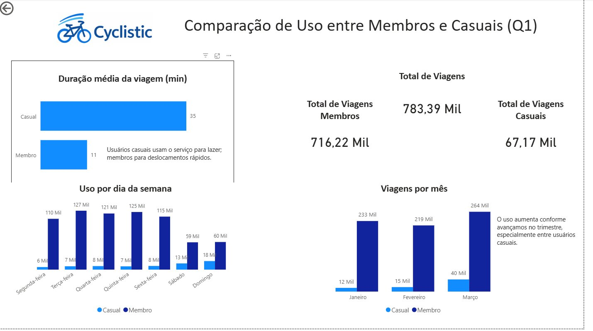

# 🚲 Cyclistic Bike-Share — Análise de Dados

> **Case Study 1** do curso [Google Data Analytics (Coursera)](https://www.coursera.org/learn/google-data-analytics-capstone/home/welcome)

---

## 📋 Sobre o Projeto

Este é o meu primeiro projeto de análise de dados, desenvolvido como trabalho de conclusão do curso **Google Data Analytics** da Coursera.

O objetivo foi analisar o comportamento de uso de uma empresa fictícia de compartilhamento de bicicletas chamada **Cyclistic**, com foco em entender as diferenças entre dois tipos de usuários: **membros anuais** e **ciclistas casuais**, a fim de apoiar uma estratégia de marketing para converter ciclistas casuais em membros.

---

## ❓ Pergunta de Negócio

> *"Como os membros anuais e os ciclistas casuais usam as bicicletas Cyclistic de forma diferente?"*

---

## 🗂️ Estrutura do Repositório

```
cyclistic-case-study/
│
├── README.md                       # Você está aqui
├── Analise_Bicicletas.ipynb        # Análise exploratória em Python
├── Dashboard.pbix                  # Dashboard interativo no Power BI
└── docs/
    └── Case_Study_1_Cyclistic.pdf  # Proposta original do case study
```

---

## 🔄 Processo de Análise

O projeto seguiu o framework de análise de dados do Google:

| Etapa | Descrição |
|-------|-----------|
| **Ask** | Definição da pergunta de negócio e objetivos |
| **Prepare** | Coleta e organização dos dados históricos de viagens (Q1 2019 e Q1 2020) |
| **Process** | Limpeza e transformação dos dados com Python |
| **Analyze** | Análise exploratória e identificação de padrões de uso |
| **Share** | Dashboard interativo no Power BI |
| **Act** | Recomendações estratégicas baseadas nos insights |

---

## 🛠️ Ferramentas Utilizadas

| Ferramenta | Uso |
|------------|-----|
| **Python** | Análise exploratória, limpeza e manipulação de dados |
| **Pandas** | Manipulação de DataFrames |
| **Matplotlib / Seaborn** | Gráficos exploratórios |
| **Power BI** | Dashboard e visualizações interativas |

---

## 📊 Dashboard



> *Dashboard desenvolvido no Power BI comparando o comportamento de membros e usuários casuais no primeiro trimestre.*

---

## 🔍 Principais Insights

### 1. Usuários casuais fazem viagens muito mais longas
- Duração média — Casuais: **~35 min** | Membros: **~11 min**
- Casuais usam a bicicleta principalmente para lazer, passeio e turismo
- Membros utilizam como transporte rápido do dia a dia

> 💡 Usuários casuais utilizam o serviço por mais tempo, indicando comportamento voltado ao lazer, não à mobilidade cotidiana.

---

### 2. Membros concentram a maior parte do volume de viagens
- Total de viagens — Membros: **~716 mil** | Casuais: **~67 mil**
- Membros representam a esmagadora maioria do uso operacional

> 💡 O modelo de assinatura sustenta o volume da Cyclistic. Os membros são a base principal do negócio.

---

### 3. O padrão de uso muda radicalmente conforme o dia da semana
- **Membros:** uso alto de segunda a sexta, queda no fim de semana → perfil de commuter (trabalho/estudo)
- **Casuais:** crescimento expressivo no sábado e domingo → perfil de lazer

> 💡 Este talvez seja o insight mais estratégico do projeto: o comportamento semanal revela motivações completamente distintas entre os dois grupos.

---

### 4. O volume de viagens cresce ao longo do trimestre
- Janeiro → menor volume | Fevereiro → volume médio | Março → **pico de uso**
- O crescimento é ainda mais expressivo entre usuários casuais

> 💡 A melhora do clima e a chegada da primavera impulsionam o uso recreativo, criando uma janela estratégica para campanhas de conversão.

---

## 💼 Conclusão e Recomendações Estratégicas

Com base nos insights acima, a principal oportunidade da Cyclistic está em converter usuários casuais — que já conhecem e utilizam o serviço — em membros anuais.

**Recomendação principal:**
> Criar campanhas direcionadas a usuários casuais que já pedalam com frequência, destacando os benefícios financeiros da assinatura para quem pedala por longos períodos e especialmente nos fins de semana.

**Ações sugeridas:**

| Ação | Justificativa |
|------|---------------|
| 🎯 Campanha "Pedale mais, pague menos" | Casuais fazem viagens longas — assinatura seria mais econômica |
| 📅 Plano promocional de fim de semana | Pico de uso casual é no sábado e domingo |
| 🌱 Campanha sazonal em março | Maior adesão de casuais no final do trimestre |
| 💰 Desconto no primeiro mês de assinatura | Reduzir a barreira de entrada para o plano anual |

---

## 📁 Dados

Os dados utilizados são públicos, disponibilizados pela **Motivate International Inc.** sob [licença pública](https://divvybikes.com/data-license-agreement). Por questões de tamanho, os arquivos de dados brutos não estão incluídos neste repositório.

Datasets utilizados:
- `Divvy_Trips_2019_Q1.csv`
- `Divvy_Trips_2020_Q1.csv`

---

## 👤 Autor

**Carlos Henrique Freitas**
📧 ch_freitas@hotmail.com
💼 [LinkedIn](https://www.linkedin.com/in/carlos-freitas-086b66349/)
🐙 [GitHub](https://github.com/Finnagun)

---

> *Este foi meu primeiro projeto de análise de dados, desenvolvido durante a transição de carreira da fisioterapia intensivista para a área de dados. Faz parte do processo — e do portfólio.*
